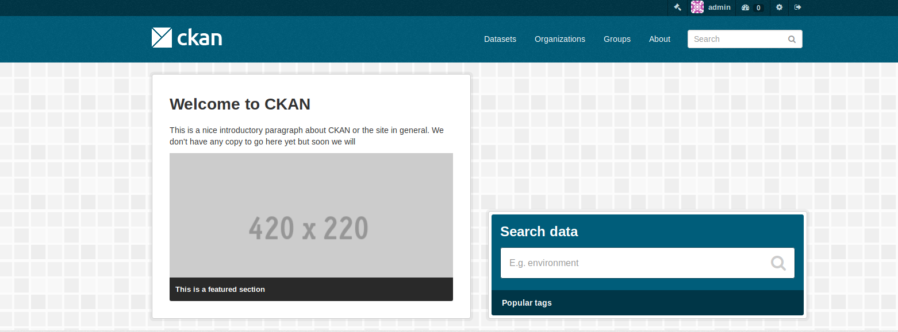
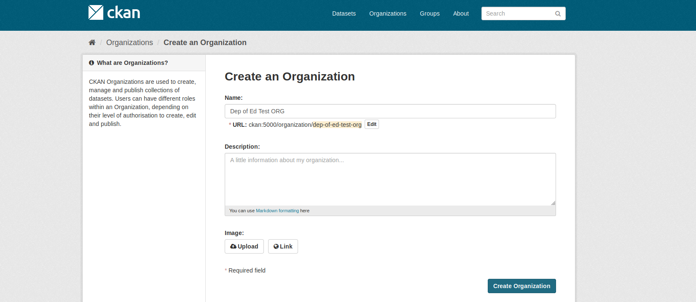
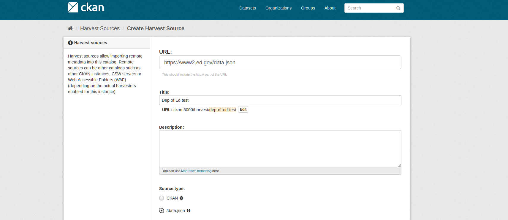
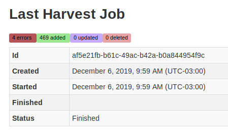

# Harvest Departament of Education source

Using [docker-ckan](https://github.com/ckan/ckan-docker) with ckanext-harvest and ckanext-datajson extensions.  

Clean docker volumes to start from scratch.

```
docker-compose -f docker-compose.dev.yml down -v 
```
Start CKAN (with harvest and datajson extensions)

```
docker-compose -f docker-compose.dev.yml up
```



First we need to create an organization.  



Create a harvest source pointing to https://www2.ed.gov/data.json.  



Get inside terminal:
```
docker-compose -f docker-compose.dev.yml exec ckan-dev bash
```

Create a job for this source (check the name/id)
```
paster --plugin=ckanext-harvest harvester job dep-of-ed-test
```

Read the source 
```
paster --plugin=ckanext-harvest harvester gather_consumer

2019-12-06 12:45:48,426 DEBUG [ckanext.harvest.queue] Gather queue consumer registered.
2019-12-06 12:45:48,427 DEBUG [ckanext.harvest.queue] Received harvest job id: c6dcfe87-391d-40b6-aba5-517e99ec527c
2019-12-06 12:45:48,433 DEBUG [ckanext.datajson.harvester_base] In <Plugin DataJsonHarvester 'datajson_harvest'> gather_stage (https://www2.ed.gov/data.json)
2019-12-06 12:45:48,433 INFO  [ckanext.datajson.harvester_datajson] Loading catalog from URL: https://www2.ed.gov/data.json
2019-12-06 12:46:07,636 INFO  [ckanext.datajson.harvester_datajson] BOM_UTF8 removed from URL: https://www2.ed.gov/data.json
2019-12-06 12:46:07,699 INFO  [ckanext.datajson.harvester_datajson] Catalog Loaded from URL: https://www2.ed.gov/data.json: 473 datasets found
/srv/app/src_extensions/ckanext-datajson/ckanext/datajson/harvester_base.py:87: YAMLLoadWarning: calling yaml.load() without Loader=... is deprecated, as the default Loader is unsafe. Please read https://msg.pyyaml.org/load for full details.
  source_config = yaml.load(harvest_source.config)
/usr/lib/python2.7/site-packages/sqlalchemy/orm/session.py:2181: SAWarning: Usage of the 'related attribute set' operation is not currently supported within the execution stage of the flush process. Results may not be consistent.  Consider using alternative event listeners or connection-level operations instead.
  % method)
/usr/lib/python2.7/site-packages/sqlalchemy/orm/session.py:2181: SAWarning: Usage of the 'collection append' operation is not currently supported within the execution stage of the flush process. Results may not be consistent.  Consider using alternative event listeners or connection-level operations instead.
  % method)
/usr/lib/python2.7/site-packages/sqlalchemy/orm/session.py:2276: SAWarning: Attribute history events accumulated on 1 previously clean instances within inner-flush event handlers have been reset, and will not result in database updates. Consider using set_committed_value() within inner-flush event handlers to avoid this warning.
  % len_)
2019-12-06 12:46:08,720 INFO  [ckanext.harvest.model] Duplicate entry ignored for identifier: 'OPEPD_2014002'.
2019-12-06 12:46:09,808 INFO  [ckanext.harvest.model] Duplicate entry ignored for identifier: 'OSERS_2013001'.
2019-12-06 12:46:10,235 INFO  [ckanext.harvest.model] Duplicate entry ignored for identifier: 'NCES_2009479'.
2019-12-06 12:46:11,507 INFO  [ckanext.harvest.model] Duplicate entry ignored for identifier: 'NCES_2016999'.
2019-12-06 12:46:11,820 DEBUG [ckanext.harvest.queue] Received from plugin gather_stage: 469 objects (first: [u'9f2239d1-2de6-4cac-a07d-0d66d67f72eb'] last: [u'b7502972-68c6-4891-9d9e-b985a37a0dfc'])
2019-12-06 12:46:11,869 DEBUG [ckanext.harvest.queue] Sent 469 objects to the fetch queue
```

Note the duplicates and cleaned BOM_UTF8

Fetch and import
```
paster --plugin=ckanext-harvest harvester fetch_consumer
```

Finish job (not finishing by it self)
```
paster --plugin=ckanext-harvest harvester job_abort dep-of-ed-test
```

View results: http://ckan:5000/harvest/admin/dep-of-ed-test  



Errors:
 - If we re-harvest this same source the packages duplicates
 - Define if all Tags go to lower in order to avoid duplication


